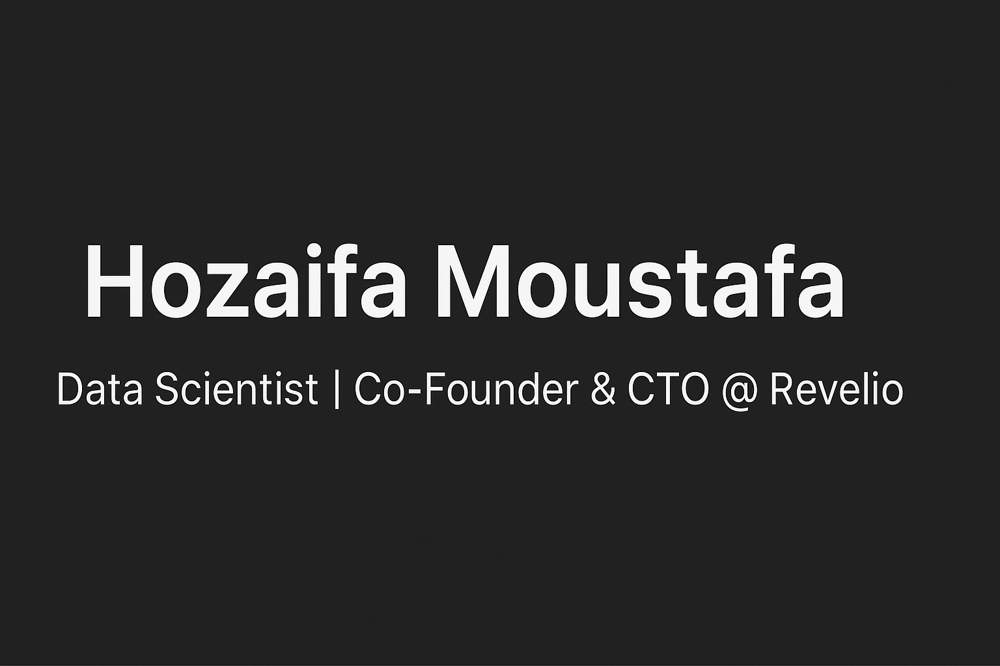

<!-- Banner 

  

-->
<h1 align="center">Hi 👋, I'm Hozaifa Moustafa</h1>
<h3 align="center">💻 Data Scientist | 🚀 Co-Founder & CTO @ Revelio</h3>

---

## 🚀 About Me  
I’m a Data Scientist and Co-Founder & CTO at **Revelio**.  
My work focuses on **building data-driven solutions** that transform raw information into business value.  
I specialize in **analytics, machine learning, and scalable systems** that help organizations make smarter decisions.  

---

## 🛠️ Tech Stack  

  
  
  
  

---

## 📊 GitHub Stats  

  
  

---

## 🔨 Currently Working On  
- 🎓 **UpHeal** – My graduate project focused on **data-driven insights for healthcare/wellbeing**  

---

## 🌟 Featured Projects  
💼 **[Revelio](https://github.com/RevelioTech)**  
Delivering tailored **data science & analytics solutions** for businesses.  

🧠 **[UpHeal](https://github.com/your-upheal-link)**  
Graduate project bringing **AI-driven improvements** to wellbeing analysis.  

---

## 📫 Connect with Me  

  
  

